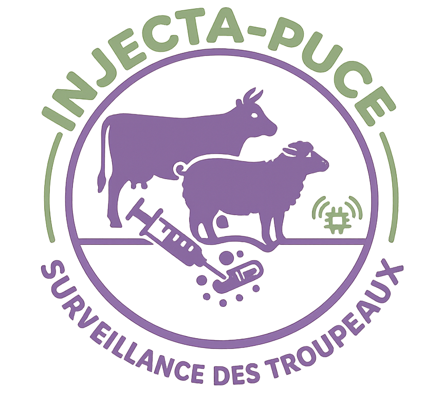

<table border="0" cellpadding="0" cellspacing="0" style="border: 0; border-collapse: collapse;">
  <tr>
    <td width="180" align="center" valign="middle" style="border: 0;">
      
    </td>
    <td valign="middle" style="border: 0;">
      <h1>InSense</h1>
      <p>Smart livestock monitoring through connected biometric and GPS data.</p>
      <p>
        <a href="https://github.com/adam-dev-hub">Adam's GitHub</a>
        ·
        <a href="https://github.com/raniahaddajipro-ux">Rania's GitHub</a>
      </p>
    </td>
  </tr>
</table>

## Overview

InSense is a smart-agriculture IoT concept for monitoring livestock health and location from a mobile application. The system combines an injectable, low-power sensor concept with an ESP32/Python simulator and a ThingsBoard cloud dashboard.

The mobile application provides breeders with a real-time overview of their animals, health indicators, biometric history, geofencing, map locations, and veterinary or technical support screens.

> The hardware is represented by an ESP32 simulation. The project focuses on the IoT architecture, telemetry flow, and mobile user experience rather than a production-ready implantable device.

## Features

- Live animal monitoring from ThingsBoard telemetry
- Temperature, heart rate, glucose, blood pressure, and battery readings
- GPS location display and geofence support
- Animal detail pages with biometric history charts
- Local history persistence with AsyncStorage
- Sensor-malfunction and abnormal-health detection
- Animal management, settings, veterinary support, and technical support screens
- Python simulator generating healthy, sick, and faulty-sensor telemetry

## Architecture

```text
ESP32 / Python simulator
          │
          │ MQTT telemetry
          ▼
      ThingsBoard
          │
          │ REST API + JWT
          ▼
   React Native / Expo app
          │
          ├── Dashboard and animal details
          ├── Map and geofence monitoring
          └── Local history with AsyncStorage
```

## Technology Stack

| Area | Technologies |
| --- | --- |
| Mobile app | React Native, Expo, Expo Router |
| Navigation | React Navigation, Expo Router tabs |
| Data visualisation | React Native Chart Kit |
| Maps | React Native Maps |
| Cloud platform | ThingsBoard REST API and MQTT |
| Local persistence | AsyncStorage |
| Icons and UI | Lucide React Native, Expo Linear Gradient |
| Hardware simulation | Python, Paho MQTT |

## Project Structure

```text
.
├── app/                         # Expo Router screens
│   ├── animal/[id].jsx          # Animal details and history
│   ├── index.jsx                # Monitoring dashboard
│   ├── map.jsx                  # Animal locations and geofencing
│   ├── manage.jsx               # Animal management
│   ├── settings.jsx             # Application settings
│   └── vets/                    # Veterinary and technical support
├── src/
│   ├── components/              # Animal cards and biometric charts
│   ├── hooks/                   # Geofence and reusable state logic
│   └── services/                # ThingsBoard authentication and telemetry
├── simulation/
│   └── python_simulator.py      # MQTT livestock telemetry simulator
├── assets/                      # App icons and visual assets
├── app.json                     # Expo configuration
└── package.json                 # Scripts and dependencies
```

## Requirements

- Node.js LTS and npm
- Expo CLI through the local project dependencies
- Android Studio and Android SDK for native Android builds
- Python 3.9+ for the telemetry simulator
- A ThingsBoard account and a configured device

## Installation

```bash
npm install
```

## Run the Mobile App

Start the Expo development server:

```bash
npm run start
```

Run a native Android build:

```bash
npm run android
```

Other available commands:

```bash
npm run ios
npm run web
```

## ThingsBoard Configuration

The mobile client reads its connection settings from `src/services/thingsboard.js`.

Before running the app, configure:

- `TB_HOST` for the ThingsBoard instance
- `TB_USERNAME` and `TB_PASSWORD` for REST authentication
- `TB_CONFIG.DEVICE_NAME` for the telemetry device
- Android Maps API key in `app.json` when building for Android

The expected telemetry keys are:

```text
temperature, bpm, glucose, bloodPressure,
latitude, longitude, battery, animalData
```

Do not commit real ThingsBoard credentials or API keys. Use environment-specific configuration for shared or production deployments.

## Run the Python Simulator

Install the MQTT client dependency:

```bash
python -m pip install paho-mqtt
```

Configure the ThingsBoard MQTT access token in `simulation/python_simulator.py`, then run:

```bash
python simulation/python_simulator.py
```

The simulator publishes a collection of animals every three minutes. It can model normal animals, progressive illness, battery drain, and intermittent sensor failures.

## Telemetry Model

Each simulated animal includes an identifier, species, breed, RFID, GPS coordinates, health values, battery level, and sensor status. The application uses these values to calculate a health score and highlight abnormal or unavailable readings.

Example payload fields:

```json
{
  "animalId": "COW-001",
  "name": "Bessie",
  "type": "cow",
  "temperature": 38.4,
  "bpm": 72,
  "glucose": 4.4,
  "bloodPressure": "120/80",
  "latitude": 36.0993,
  "longitude": 9.5811,
  "battery": 92,
  "sensorStatus": "HEALTHY"
}
```

## Project Context

InSense was designed as an IoT architecture study for intelligent agriculture. Miniaturised, low-power SiP/SoC hardware is represented by an ESP32 simulation so the project can demonstrate the complete data path from sensing and communication to mobile supervision.

## Authors

This is a collaborative project by **Adam Farjeoui** and **Rania Haddaji**.

- **Adam Farjeoui** — [Website](https://farjeoui-portfolio.vercel.app) · [GitHub](https://github.com/adam-dev-hub) · [LinkedIn](https://linkedin.com/in/adam-al-farjeoui)
- **Rania Haddaji** — [GitHub](https://github.com/raniahaddajipro-ux) · [LinkedIn](https://tn.linkedin.com/in/rania-haddaji-69357129b)

## Academic Supervision

The project was developed under the academic guidance of:

- **Dr. Afef Saidi** — [LinkedIn](https://tn.linkedin.com/in/afef-saidi)
- **Dr. Meriam Dhouibi** — [LinkedIn](https://www.linkedin.com/in/meriem-dhouibi-12a459183)

## License

This repository is a project prototype and architecture study. Contact the author before reusing the implementation in a production livestock-monitoring or medical context.
